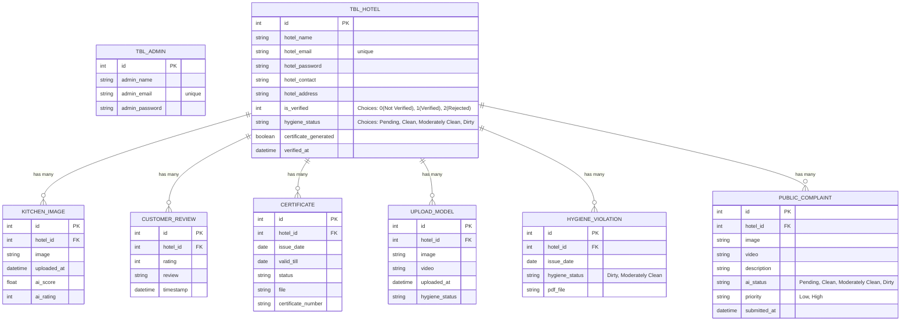

# Kitchen Hygiene - Database Design

This document outlines the detailed database design for the **Kitchen Hygiene** application based on its current implementation in Django models.

## Entity-Relationship Diagram

---

## Detailed Table Schema

### 1. `Admin` App Models

#### Table: `tbl_admin`
Stores system administrators who manage the platform and approve hotel accounts.
* **`id`** (Primary Key, Auto-increment)
* **`admin_name`** (CharField, 100): Full name of the admin.
* **`admin_email`** (EmailField): Unique email address used for login.
* **`admin_password`** (CharField, 128): Hashed password.

---

### 2. `User` App Models

#### Table: `tbl_hotel`
Stores information about the registered hotels/kitchens on the platform.
* **`id`** (Primary Key, Auto-increment)
* **`hotel_name`** (CharField, 100): Name of the hotel or kitchen.
* **`hotel_email`** (EmailField): Unique contact email address.
* **`hotel_password`** (CharField, 128): Hashed password.
* **`hotel_contact`** (CharField, 20): Optional contact number.
* **`hotel_address`** (CharField, 255): Optional physical address.
* **`is_verified`** (IntegerField): Admin verification status.
  * `0`: Not Verified
  * `1`: Verified
  * `2`: Rejected
* **`hygiene_status`** (CharField, 50): Current AI predicted hygiene status (`Pending`, `Clean`, `Moderately Clean`, `Dirty`). Default is `Pending`.
* **`certificate_generated`** (BooleanField): Indicates if a hygiene certificate has been created.
* **`verified_at`** (DateTimeField): Timestamp when the admin verified the hotel.

#### Table: `KitchenImage`
Stores images of the kitchens uploaded for continuous AI evaluation.
* **`id`** (Primary Key, Auto-increment)
* **`hotel_id`** (ForeignKey to `tbl_hotel`): The hotel owner of this image.
* **`image`** (ImageField): Path to the uploaded image.
* **`uploaded_at`** (DateTimeField): Auto-populated timestamp of upload.
* **`ai_score`** (FloatField): Optional score assigned by AI evaluation.
* **`ai_rating`** (IntegerField): Optional rating (e.g., out of 5) from AI evaluation.

#### Table: `CustomerReview`
Stores public reviews and ratings given to specific hotels by customers.
* **`id`** (Primary Key, Auto-increment)
* **`hotel_id`** (ForeignKey to `tbl_hotel`): The targeted hotel.
* **`rating`** (PositiveSmallIntegerField): Numerical rating (e.g., 1 to 5).
* **`review`** (TextField): Written review text. Optional.
* **`timestamp`** (DateTimeField): Timestamp of review submission.

#### Table: `Certificate`
Stores formal hygiene certificates issued to approved/verified hotels.
* **`id`** (Primary Key, Auto-increment)
* **`hotel_id`** (ForeignKey to `tbl_hotel`): The hotel receiving the certificate.
* **`issue_date`** (DateField): Auto-populated issuance date.
* **`valid_till`** (DateField): Expiration date of the certificate.
* **`status`** (CharField, 20): Certificate status (e.g., `Active`).
* **`file`** (FileField): Optional uploaded PDF/document file.
* **`certificate_number`** (CharField, 50): Custom unique identifying string for the certificate.

#### Table: `UploadModel`
Stores temporary or periodic media uploads by the hotel for hygiene tracking.
* **`id`** (Primary Key, Auto-increment)
* **`hotel_id`** (ForeignKey to `tbl_hotel`): The hotel that uploaded.
* **`image`** (ImageField): Optional image.
* **`video`** (FileField): Optional video.
* **`uploaded_at`** (DateTimeField): Timestamp of upload.
* **`hygiene_status`** (CharField, 50): Explicit state related to this media (e.g., `Clean`, `Dirty`). Default is `Pending`.

#### Table: `HygieneViolation`
Stores records of poor hygiene incidents linked to a hotel along with an optional PDF evidence report.
* **`id`** (Primary Key, Auto-increment)
* **`hotel_id`** (ForeignKey to `tbl_hotel`): The violating hotel.
* **`issue_date`** (DateField): Timestamp of the violation notice.
* **`hygiene_status`** (CharField, 50): Describes the explicit violated state (e.g., `Dirty`, `Moderately Clean`).
* **`pdf_file`** (FileField): Attached generated PDF report.

#### Table: `PublicComplaint`
Stores complaints lodged by public/customers that go through immediate AI analysis.
* **`id`** (Primary Key, Auto-increment)
* **`hotel_id`** (ForeignKey to `tbl_hotel`): The hotel being complained about.
* **`image`** (ImageField): Optional image evidence.
* **`video`** (FileField): Optional video evidence.
* **`description`** (TextField): Optional textual context.
* **`ai_status`** (CharField, 50): The analyzed validity/severity of the complaint (`Pending`, `Clean`, `Moderately Clean`, `Dirty`). Default is `Pending`.
* **`priority`** (CharField, 20): Internal triage priority (`Low`, `High`). Default is `Low`.
* **`submitted_at`** (DateTimeField): Registration time of the complaint.
