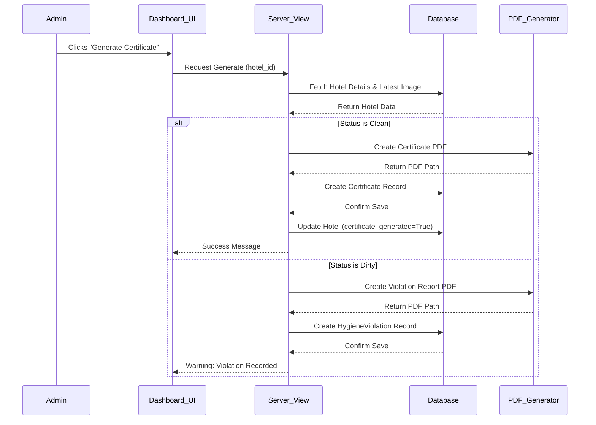
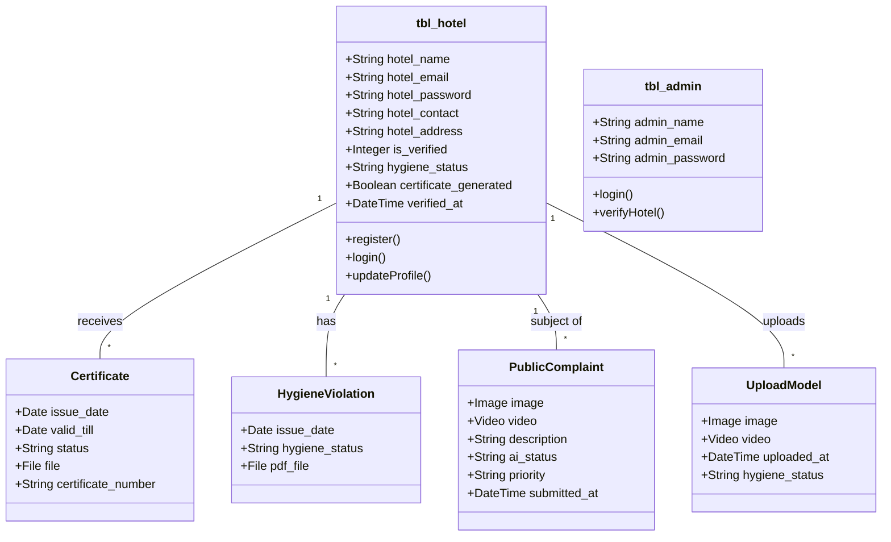

# 4 System Design

## 4.1 Use Case Model

The Use Case Model identifies the actors and the key interactions they have with the **RateMyKitchen** system.

### Actors
1.  **Admin**: The system administrator who manages the platform, verifies hotels, and oversees hygiene analysis.
2.  **Hotel (User)**: The business entity (restaurant/hotel) that registers on the platform to demonstrate compliance and view their hygiene status.
3.  **Guest / Public**: Public users who can view the website, report violations, and check hotel ratings (implied).
4.  **System (AI)**: The automated component (YOLOv8 Model) that performs image/video analysis to detect hygiene violations.

### Use Cases

**Admin:**
*   **Login**: Authenticate into the admin dashboard.
*   **View Dashboard**: View statistics (Total Kitchens, Clean/Dirty Counts, Pending Verifications).
*   **Manage Hotels**: View list of registered hotels.
*   **Verify Hotel**: Approve or reject new hotel registrations.
*   **Upload Media for Analysis**: Upload kitchen images or videos for a specific hotel to trigger AI hygiene checks.
*   **Generate Certificate**: Generate and issue a hygiene certificate if the status is "Clean".
*   **View Reports**: Access generated violation reports.
*   **View Public Complaints**: Review complaints submitted by the public.

**Hotel:**
*   **Register**: Create a new account with basic details (Name, Email, Contact, Address).
*   **Login**: Authenticate into the hotel dashboard (requires Admin approval).
*   **View Dashboard**: View current hygiene status, reviews count, and uploaded images count.
*   **Manage Profile**: Edit profile details and change password.
*   **View Certificates**: View and download issued hygiene certificates.
*   **View Violation Reports**: View and download violation reports if hygiene status is poor.

**Guest / Public:**
*   **View Homepage**: Access the landing page.
*   **Report Violation**: Submit a complaint regarding a hotel, including uploading evidence (image/video).

---

## 4.2 Activity Diagram

### Process: Hotel Registration and Verification

```mermaid
graph TD
    Start((Start)) --> HotelRegisters[Hotel Submits Registration Form]
    HotelRegisters --> SystemValidates[System Validates Input]
    SystemValidates -- Invalid --> ShowError[Show Error Message]
    ShowError --> HotelRegisters
    SystemValidates -- Valid --> CreateRecord[Create Account (Status: Pending)]
    CreateRecord --> NotifyAdmin[Registration Listed for Admin]
    NotifyAdmin --> AdminReviews[Admin Reviews Details]
    AdminReviews --> Decision{Approve?}
    Decision -- Yes --> SetVerified[Set Status = Verified]
    SetVerified --> EnableLogin[Enable Login for Hotel]
    Decision -- No --> SetRejected[Set Status = Rejected]
    SetRejected --> DisableLogin[Block Login]
    EnableLogin --> End((End))
    DisableLogin --> End
```

### Process: Kitchen Hygiene Analysis

```mermaid
graph TD
    Start((Start)) --> AdminSelects[Admin Selects Hotel]
    AdminSelects --> UploadMedia[Upload Image/Video]
    UploadMedia --> SystemAI[System Calls YOLOv8 Model]
    SystemAI --> Analyze[Analyze Frames/Image]
    Analyze --> Detect[Detect Objects (Clean/Dirty)]
    Detect --> DetermineStatus{Is Dirty?}
    DetermineStatus -- Yes --> SetDirty[Set Status = Dirty]
    SetDirty --> GenReport[Generate Violation Report]
    DetermineStatus -- No --> SetClean[Set Status = Clean]
    SetClean --> GenCert[Generate Clean Certificate]
    GenReport --> SaveDB[Update Database]
    GenCert --> SaveDB
    SaveDB --> NotifyHotel[Hotel Can View Result]
    NotifyHotel --> End((End))
```

---

## 4.3 Sequence Diagram

### Scenario: Admin Generates Hygiene Certificate



---

## 4.4 List of identified classes, attributes, and their relationships

### 4.4.1 Identified Classes
1.  **tbl_admin**
2.  **tbl_hotel**
3.  **KitchenImage**
4.  **CustomerReview**
5.  **Certificate**
6.  **UploadModel**
7.  **HygieneViolation**
8.  **PublicComplaint**

### 4.4.2 Identified Attributes

*   **tbl_admin**
    *   `admin_name` (String)
    *   `admin_email` (Email)
    *   `admin_password` (String)

*   **tbl_hotel**
    *   `hotel_name` (String)
    *   `hotel_email` (Email)
    *   `hotel_password` (String)
    *   `hotel_contact` (String)
    *   `hotel_address` (String)
    *   `is_verified` (Integer: 0=Pending, 1=Verified, 2=Rejected)
    *   `hygiene_status` (String: Pending, Clean, Dirty...)
    *   `certificate_generated` (Boolean)
    *   `verified_at` (DateTime)

*   **KitchenImage**
    *   `image` (ImageFile)
    *   `uploaded_at` (DateTime)
    *   `ai_score` (Float)
    *   `ai_rating` (Integer)

*   **Certificate**
    *   `issue_date` (Date)
    *   `valid_till` (Date)
    *   `status` (String)
    *   `file` (File)
    *   `certificate_number` (String)

*   **HygieneViolation**
    *   `issue_date` (Date)
    *   `hygiene_status` (String)
    *   `pdf_file` (File)

*   **PublicComplaint**
    *   `image` (ImageFile)
    *   `video` (File)
    *   `description` (String)
    *   `ai_status` (String)
    *   `priority` (String)
    *   `submitted_at` (DateTime)

### 4.4.3 Identified Relationships
*   **tbl_hotel (1) --- (M) KitchenImage**: One hotel can have multiple kitchen images uploaded.
*   **tbl_hotel (1) --- (M) CustomerReview**: One hotel can receive multiple reviews.
*   **tbl_hotel (1) --- (M) Certificate**: One hotel can be issued multiple certificates over time.
*   **tbl_hotel (1) --- (M) UploadModel**: One hotel can have multiple analysis uploads.
*   **tbl_hotel (1) --- (M) HygieneViolation**: One hotel can have multiple violation reports.
*   **tbl_hotel (1) --- (M) PublicComplaint**: One hotel can be the subject of multiple public complaints.

---

## 4.5 Class Diagram



---

## 4.6 Database Design

The database is implemented using SQLite (for development) or PostgreSQL/MySQL (for production), managed via Django's ORM.

### Table: `User_tbl_hotel`
| Field | Type | Attributes | Description |
| :--- | :--- | :--- | :--- |
| `id` | Integer | PK, Auto-increment | Unique Identifier |
| `hotel_name` | Varchar(100) | Not Null | Name of the hotel |
| `hotel_email` | Varchar(254) | Unique, Not Null | Login Email |
| `hotel_password` | Varchar(128) | Not Null | Hashed password |
| `is_verified` | Integer | Default: 0 | 0:Pending, 1:Verified, 2:Rejected |
| `hygiene_status` | Varchar(50) | Default: 'Pending' | Current AI status |

### Table: `Admin_tbl_admin`
| Field | Type | Attributes | Description |
| :--- | :--- | :--- | :--- |
| `id` | Integer | PK, Auto-increment | Unique Identifier |
| `admin_email` | Varchar(254) | Unique | Admin Login Email |
| `admin_password` | Varchar(128) | Not Null | Admin Password |

### Table: `User_certificate`
| Field | Type | Attributes | Description |
| :--- | :--- | :--- | :--- |
| `id` | Integer | PK, Auto-increment | Unique Identifier |
| `hotel_id` | Integer | FK | Reference to `tbl_hotel` |
| `issue_date` | Date | Not Null | Date of issuance |
| `valid_till` | Date | Not Null | Expiry date |
| `file` | Varchar(100) | Nullable | Path to PDF file |

### Table: `User_publiccomplaint`
| Field | Type | Attributes | Description |
| :--- | :--- | :--- | :--- |
| `id` | Integer | PK, Auto-increment | Unique Identifier |
| `hotel_id` | Integer | FK | Reference to `tbl_hotel` |
| `description` | Text | Nullable | Complaint details |
| `ai_status` | Varchar(50) | Default: 'Pending' | Result of auto-analysis |
| `priority` | Varchar(20) | Default: 'Low' | High if 'Dirty' detected |

---

## 4.7 UI Design

The User Interface (UI) follows a modern **Glassmorphism** design aesthetic, utilizing semi-transparent backgrounds with blur effects (`backdrop-filter: blur`), mesh gradients, and floating orbs to create a premium and clean look.

### Key UI Elements
*   **Color Palette**:
    *   **Primary**: Gold/Bronze (`#C9A961`) - Represents quality and premium standards.
    *   **Dark**: Deep Grey/Black (`#1A1A1A`) - For text and contrast.
    *   **Light**: Off-White (`#F8F9FA`) - Backgrounds.
    *   **Success**: Green (`#10b981`) - For 'Clean' status and 'Verified' badges.
    *   **Danger**: Red (`#ef4444`) - For 'Dirty' status and 'Violations'.

### Screens
1.  **Landing Page (Guest)**:
    *   Features a hero section with animated floating particles and gradient waves.
    *   Provides options for Hotel Login and Registration.
    *   "Report Violation" feature accessible to the public.

2.  **Hotel Registration**:
    *   A centered glass-effect card (`register-card`) containing form fields for Name, Email, Password, and Address.
    *   Real-time validations with modal popups for success/error messages.

3.  **Admin Dashboard**:
    *   **Stats Grid**: Four cards displaying Total Kitchens, Hygiene Safe counts, Violations, and Pending Approvals. Each card has a distinct color accent (Primary, Success, Danger, Warning).
    *   **Charts**: Interactive `Chart.js` visualizations for Hygiene Trends and Registration Status.
    *   **Recent Activity Table**: A list of recently registered hotels with status badges (Verified/Pending) and action buttons.

4.  **Hotel Dashboard**:
    *   Displays the hotel's current hygiene status prominently.
    *   Sections for "My Certificates" and "Violation Reports".
    *   Profile management interface maintaining the glassmorphism theme.
